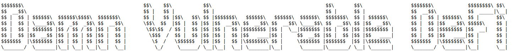

**A set of challenges to learn offensive security of smart contracts in Ethereum.**

Featuring flash loans, price oracles, governance, NFTs, lending pools, smart contract wallets, timelocks, and more!

## Play

Visit [damnvulnerabledefi.xyz](https://damnvulnerabledefi.xyz)

## Support

For Q&A, support and troubleshooting running Damn Vulnerable DeFi, go [here](https://github.com/tinchoabbate/damn-vulnerable-defi/discussions/categories/support-q-a-troubleshooting).

## Disclaimer

All Solidity code, practices and patterns in this repository are DAMN VULNERABLE and for educational purposes only.

DO NOT USE IN PRODUCTION.

---

## Solutions

**Please view v2-solutions branch for v2.2.0 solutions of damnvulnerabledefi.**

- All contracts of levels needing a contract as part of the solution can be found at ./contracts/player-contracts and script at individual level test script at EXECUTION line. Description of individual solution level below.

### 1 - Unstoppable

- The contract checks for deposited funds in line 40 of UnstoppableLender contract. If the contract receives external funds, the poolBalance will no longer be equal to balanceBefore and will cause the error thus stopping flashloan() function and making it unuseable.

### 2 - Naive receiver

- Anyone can call the flashLoan() function in NaiveReceiverLenderPool contract since the check is only available in the FlashLoanReceiver contract. Calling the function multiple times with the User address as borrower will drain it with the Fixed fee. Calling the function ten times since fixed fee is 1 ETH.

### 3 - Truster

- Attacker can approve a maliscious address to drain the DVT tokens.

### 4 - Side entrance

- Attacker can call flashloan and deposit the amount then immediatly withdraw.

### 5 - The Rewarder

- When the new rounds of rewards start, Attacker will get a flashloan of all the DVT tokens and then deposit to the rewarder pool contract thus will trigger the distribute all to the Attacker. Then immediately withdraw to payy all the tokens.

### 6 - Selfie

- Attacker can drain all the funds from the pool by activating the drainAllFunds() function. Attacker needs to meet use the SimpleGovernance contract and satisfy its condition of having half the governance token in the snapshot. It could be done by borrowing in lending pool then taking a snapshot then run executeAction() function after the ACTION_DELAY_IN_SECONDS has passed.

### 7 - Compromised

- The strange snippet was actually the private keys and thus with that the atcker can manipulate the oracle to manipulate the price to zero then buy the nft then manipulate the price back to something expensive then sell the nft.

### 8 - Puppet

- Attacker can manipulate the price of the token from the oracle function by manipulating the balance of the Uniswap pool. Attacker exchanges all his tokens to ETH so that the price of tokens drop and attacker may now borrow all the tokens with the new discounted price of around 19-20 ETH thus draining the contract of all of its token.

### 9 - Puppet-v2

- Very similar to above that Attcker may once again manipulate oracle price by swapping the tokens then borrowing or getting a loan with no plans of paying it back thus efectively draining all the DVT from the contract.

### 10 - Free Rider

- There is a vulnerability with the buyMany() function in FreeRiderNFTMarketplace contract in which attacker may buy multiple nft with only paying the price of one. The function does not check for the total price but only the price of one and the contract will pay for the unpaid NFT by the attacker acting as buyer. Upon checking the test script there is a uniswapv2 in which the attacker may use flash swaps. Using a flashloan the player can barrow the needed fund and both be the buyer and seller to buy all of the NFT. This will also effectively drain the contract's ETH since it is paying for the unpaid eventually then forward to FreeRiderBuyer contract to claim the reward.

### 11 - Backdoor

- The beneficiaries in this situation has not yet setup for each wallet and so the attacker can at this point setup the wallets and claim the token for himself. The contract itself was suposed to be secure but since the users didn't know how to use the contract, the attacker was able to use the logic of the contract to transfer the contract to himself.

### 12 - Climber

- In ClimberTimelock contract, the function execute() is stated that it can be executed by anyone. The Attacker can execute a proposal that does not exist and make it as if it did exist and was ready to be executed after. With this, Attacker may grant himself the proposer role then change the logic contract with a proposal to be able to drain all the funds with no requirement.

### 13 - Wallet Mining

- Wallet Mining
